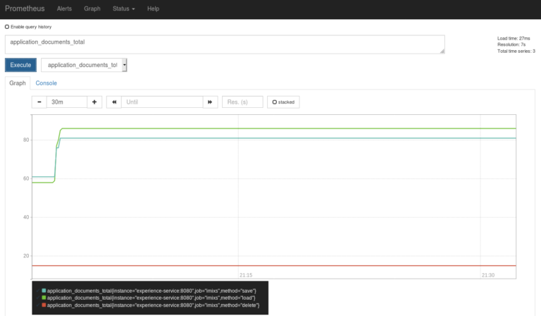
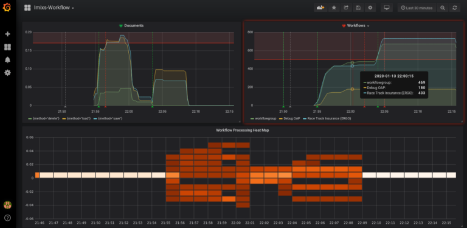

# Imixs-Metrics: Monitor

The **Imixs Metrics Monitor** provides comprehensive monitoring and analytics capabilities for an Imixs-Workflow instance.

## Overview

Organizations using Imixs-Workflow need visibility into their process execution patterns to make informed decisions about optimization and resource allocation. This module addresses that need by providing **detailed insights into workflow behavior, from simple frequency counts to complex performance analysis**. By understanding how often workflows are executed, which paths are most commonly taken, and where time is being spent, organizations can identify bottlenecks, optimize resource allocation, and improve overall process efficiency.

The module goes beyond simple counting by providing context-rich metrics that include workflow versions, task states, and event transitions. This granular level of detail enables process owners to understand not just what is happening, but why certain patterns emerge in their workflow execution.

## Core Functionality

At its heart, the Workflow Metrics module tracks every significant event that occurs during workflow execution. When a workitem is processed, the module captures detailed information about the model version, the current task, the triggered event, and the resulting workflow state. This creates a comprehensive audit trail that can be analyzed from multiple perspectives.

The module distinguishes between different types of operations, tracking document operations separately from workflow transitions. This separation allows for a more nuanced understanding of system usage, revealing patterns such as excessive document loads that might indicate inefficient process design or integration issues.

Transaction monitoring provides another layer of insight, helping administrators understand the overall system load and identify peak usage periods. This information proves invaluable for capacity planning and performance optimization efforts.

## Integration with Monitoring Ecosystems

The module builds upon the Eclipse MicroProfile Metrics API, ensuring compatibility with modern monitoring infrastructures. This standards-based approach means that Imixs metrics can be seamlessly integrated into existing monitoring setups without requiring custom adapters or proprietary protocols.

Organizations using Prometheus for metric collection will find that the module provides native support for the Prometheus exposition format. The metrics endpoint exposes all workflow metrics in a format that Prometheus can directly scrape, making it simple to incorporate workflow monitoring into existing dashboards and alerting systems.

For visualization, the module works seamlessly with Grafana, enabling the creation of rich, interactive dashboards that bring workflow data to life. Process owners can create custom views that highlight the metrics most relevant to their specific needs, from high-level executive dashboards to detailed operational views.

## Privacy and Compliance Considerations

In today's regulatory environment, data protection is paramount. The module addresses this concern by providing anonymized metrics by default, ensuring compliance with GDPR and similar regulations. All user-specific information is removed from the metrics, focusing instead on process-level insights that provide value without compromising privacy.

For organizations that require user-level metrics for specific use cases, such as workload balancing or performance management, the module offers the option to include personalized data. This flexibility ensures that the module can adapt to various organizational requirements while maintaining a secure default configuration.

## Migration from Core Engine

The extraction of metrics functionality from the core Imixs-Workflow engine into a dedicated module represents a significant architectural improvement. This separation of concerns allows the metrics module to evolve independently, enabling faster feature development and easier adoption of new monitoring standards.

Organizations currently using the embedded metrics functionality will find the migration path straightforward. The module maintains compatibility with existing metric definitions while offering enhanced capabilities that weren't possible within the constraints of the core engine. This includes improved performance through optimized data collection, reduced memory footprint, and better scalability for high-volume deployments.

## Real-World Applications

In practice, the Workflow Metrics module serves multiple stakeholder groups within an organization. Business analysts use it to understand process adoption rates and identify underutilized workflows that might benefit from additional training or redesign. IT operations teams rely on it for capacity planning and performance monitoring, using the metrics to identify system bottlenecks before they impact users.

Process owners find particular value in the module's ability to track workflow evolution over time. By comparing metrics across different model versions, they can quantify the impact of process improvements and demonstrate the value of optimization efforts to stakeholders.

## Future Direction

As part of the broader Imixs-Metrics project, this module forms the foundation for comprehensive process intelligence. While it focuses on the operational aspects of workflow execution, it provides the essential data layer that other modules, such as the Value Metrics module, build upon to deliver business-focused insights.

The module will continue to evolve with the monitoring landscape, adopting new standards and integrating with emerging monitoring platforms as they gain adoption in the enterprise space.

# Documentation

Imixs-Workflow provides runtime metrics based on the [Microprofile Metric API](https://microprofile.io/project/eclipse/microprofile-metrics). The Eclipse Microprofile Metrics specification provides an unified way to export Monitoring data ("Telemetry") to management agents and also a unified Java API.

Add the following Maven Dependency:

```xml
	<parent>
		<groupId>org.imixs.workflow</groupId>
		<artifactId>imixs-metrics</artifactId>
		<version>1.0.0-SNAPSHOT</version>
	</parent>
	<artifactId>imixs-metrics-monitor</artifactId>
```

The Imixs-Metric Serivce is disabled per default. To enable the feature set the property 'metrics.enabled' to 'true.

    metrics.enabled=true

## How to access Imixs-Workflow Metrics

The Imxis-Workflow metrics can be collected by the metric rest endpoint depending on the application server.

    # Wildfly
    http://[HOST]:9990/metrics
    # Payara
    http://[HOST]:8080/metrics

This is an example how a Imixs-Workflow metric looks like:

```
....
application_workitems_total{event="20",modelversion="invoice-1.2",task="2001",type="workitem",workflowgroup="Invoice",workflowstatus="Open"} 1.0
application_workitems_total{event="1",modelversion="todo-1.0.0",task="2000",type="workitem",workflowgroup="ToDo",workflowstatus="Offen"} 3.0
application_documents_total{method="save"} 8.0
application_documents_total{method="delete"} 3.0
application_documents_total{method="load"} 133.0
application_transactions_total 5.0
.....
```

The Document and Workflow metrics are shown here. Each metric provides a set of tags defining the method and additional metadata like the WorkflowVersion or the current workflow event processed by the Imixs-Workflow Engine.

## Anonymised Metrics

The metrics provided by the Imixs workflow platform are anonymized by default. This is important in order to comply with the data protection directives of many countries as well as within the European Union. But in some cases, it may be necessary to provide personalized metrics. For this purpose you can set the flag '_metrics.anonymised_' to 'false' (default = true). In this case, the metrics are supplemented with the tag 'user' providing the corresponding userid.

    METRICS_ENABLED: "true"
    METRICS_ANONYMISED: "false"

## Metrics Endpoint

The Metrics are based on the [Eclipse Microprofile Metric API](https://microprofile.io/project/eclipse/microprofile-metrics) which means that the metric api is part of your application server. Depending on your platform you will get a lot of hardware and environment metrics together with the Imixs-Workflow metrics. The endpoint to access the metrics depends on your server environment.

### Prometheus Configuration for Widlfly

The default metric api endpoint for Wildfly is:

    https://[HOST]:9990/metrics

A Prometheus configuration to scrape the metrics from Imixs-Workflow can look like in the following example:

    global:
      scrape_interval:     15s # By default, scrape targets every 15 seconds
      # Attach these labels to any time series or alerts when communicating with
      # external systems (federation, remote storage, Alertmanager).
      external_labels:
        monitor: 'imixs-monitor'

    scrape_configs:
      # Prometheus itself
      - job_name: 'prometheus'
        scrape_interval: 5s
        static_configs:
          - targets: ['localhost:9090']

      # Imixs-Office Job
      - job_name: 'imixs'
        scrape_interval: 5s
        metrics_path: /metrics
        static_configs:
          - targets: ['app:9990']

### Prometheus Configuration for Payara

The default metric api endpoint for Payara Server is:

    https://[HOST]:8080/metrics

A Prometheus configuration to scrape the metrics from Imixs-Workflow can look like in the following example:

```
global:
    scrape_interval:     15s # By default, scrape targets every 15 seconds.
    # Attach these labels to any time series or alerts when communicating with
    # external systems (federation, remote storage, Alertmanager).
    external_labels:
    monitor: 'imixs-monitor'

scrape_configs:
    # Prometheus itself
    - job_name: 'prometheus'
    scrape_interval: 5s
    static_configs:
        - targets: ['localhost:9090']

    # Imixs-Office Job
    - job_name: 'imixs'
    scrape_interval: 5s
    metrics_path: /metrics
    static_configs:
        - targets: ['app:8080']
```

### Prometheus Dashboard

To setup Prometheus with docker-compose you can add the container like shown in the following example:

```yaml
  prometheus:
    image: prom/prometheus:latest
    ports:
      - "9090:9090"
    volumes:
      - ./prometheus/prometheus.yml:/etc/prometheus/prometheus.yml
      - prometheusdata:/prometheus/

volumes:
  prometheusdata:
```

From the Prometheus Dashboard you can test the data within your web browser:



### Monitoring Metrics with Grafana

grafana:
image: grafana/grafana:7.1.0
ports: - "3000:3000"

To monitor you workflow you can easily connect your Prometheus server with a Grafana Instance. This allows you to visualize your metrics in an individual and more detailed dashboard.



There are a huge amount of functions available in Grafana to analyze and monitor data. You can also activate individual alerts to notify your process owner about the load of your business processes.

## Custom Metric Service

You can also implement your own custom metric service by just observing the #

```java

@ApplicationScoped
public class MyCustomMetricService {

    @Inject
    @ConfigProperty(name = "metrics.enabled", defaultValue = "false")
    private boolean metricsEnabled;

    @Inject
    @RegistryScope(scope = MetricRegistry.APPLICATION_SCOPE)
    MetricRegistry metricRegistry;

    /**
     * ProcessingEvent listener to generate a metric.
     */
    public void onProcessingEvent(@Observes ProcessingEvent processingEvent) throws AccessDeniedException {

        if (!metricsEnabled) {
            return;
        }
        try {
            Counter counter = buildMetric(processingEvent);
            counter.inc();
        } catch (IncompatibleClassChangeError | ObserverException oe) {
            mpMetricNoSupport = true;
            logger.warning("...Microprofile Metrics not supported!");
        }
    }


    /**
     * This method builds a custom Microprofile Metric
     */
    private Counter buildMetric(DocumentEvent event) {


        // create a metadata object....
        Metadata metadata = Metadata.builder().withName(METRIC_DOCUMENTS)
                .withDescription("My custom metric").build();
        ....
        ........
        // export custom metrics....
        Tag[] tags = { new Tag("my_metric", method) };
        Counter counter = metricRegistry.counter(metadata, tags);

        return counter;
    }
}
```

### Metric Types

The Eclipse MicroProfile Metrics Framework supports the different metric types:

**Counter:**

A simple incrementing counter that can only be increased
Useful for counting events like API calls or errors

Example:

```java
@Counted(name = "requestCount", absolute = true)
public void doRequest() {
    // Method implementation
}
```

**Gauge**

A gauge represents a single numerical value that can increase and decrease.
Perfect for instantaneous values like CPU usage or active threads

Example:

```java
@Gauge(unit = MetricUnits.NONE)
public int getQueueSize() {
    return queue.size();
}
```

**Meter**

The Meter metric measures the rate at which events occur over time
Calculates mean rate, one-minute, five-minute, and fifteen-minute rates

Example:

```java
@Metered(name = "requestMeter")
public void handleRequest() {
    // Request processing
}
```

**Timer**

A Timer combines Meter and Histogram for time measurements
Measures both frequency and duration of events

Example:

```java
@Timed(name = "processingTime")
public void processData() {
    // Time-intensive operation
}
```

**Histogram**

A histogram tracks the distribution of values over time
Calculates statistical values like min, max, mean, and percentiles

Example:

```java
@Metric(name = "histogram")
private Histogram histogram;
```

**ConcurrentGauge**

Specialized gauge for concurrent access
Tracks current, maximum, and minimum concurrent invocations

Example:

```java
@ConcurrentGauge(name = "activeRequests")
public void handleRequest() {
    // Concurrent request handling
}
```

# Metrics Security

The metrics endpoint `/api/metrics` exposes application metrics in Prometheus format. For production environments, we recommend a combination of network-level isolation and optional API key authentication.

## Configuration

Set these properties in your `microprofile-config.properties`:

```properties
# Enable metrics collection
metrics.enabled=true
metrics.anonymised=true

# Optional API key for additional security
metrics.api-key=your-secret-metrics-key-here
```

**Note**: If `metrics.api-key` is empty or not set, no API key validation is performed.

## API Key Usage

When an API key is configured, all metrics endpoints require the key as a query parameter:

```bash
# Access metrics with API key
curl "http://localhost:8080/your-app/api/metrics?key=your-secret-metrics-key-here"

# Access stats with API key
curl "http://localhost:8080/your-app/api/metrics/stats?key=your-secret-metrics-key-here"
```

Configure Prometheus to scrape with API key:

```yaml
scrape_configs:
  - job_name: "imixs-workflow"
    static_configs:
      - targets: ["imixs-metrics.default.svc.cluster.local:8080"]
    metrics_path: "/your-app/api/metrics"
    params:
      key: ["your-secret-metrics-key-here"] # API key as query parameter
    scrape_interval: 15s
```

## Kubernetes Deployment

If running in Kubernetes you can create in addition separate services for your application and metrics endpoints:

```yaml
# Main application service (externally accessible)
apiVersion: v1
kind: Service
metadata:
  name: imixs-app
spec:
  type: LoadBalancer
  ports:
    - port: 80
      targetPort: 8080
  selector:
    app: imixs-workflow

---
# Metrics service (cluster-internal only)
apiVersion: v1
kind: Service
metadata:
  name: imixs-metrics
  labels:
    app: metrics
spec:
  type: ClusterIP # Internal access only
  ports:
    - port: 8080
      targetPort: 8080
  selector:
    app: imixs-workflow # Same pods as main app
```

## Docker Compose Deployment

Use separate networks and environment variables:

```yaml
services:
  app:
    image: your-app:latest
    ports:
      - "80:8080" # Only main app externally accessible
    networks:
      - frontend
      - metrics-internal
    environment:
      - METRICS_API_KEY=your-secret-metrics-key-here

  prometheus:
    image: prom/prometheus:latest
    networks:
      - metrics-internal # Can reach app metrics, but not externally accessible
    volumes:
      - ./prometheus.yml:/etc/prometheus/prometheus.yml

networks:
  frontend:
  metrics-internal:
    internal: true # No external access
```

## Security Benefits

- **Network isolation**: Metrics endpoint not accessible from internet
- **API key protection**: Additional authentication layer for metrics access
- **Same application**: No code changes or separate authentication required
- **Prometheus compatibility**: Native support for query parameter authentication
- **Defense in depth**: Application authentication + network isolation + API key
- **Container native**: Leverages built-in container networking security

## Security Recommendations

1. **Use both network isolation AND API key** for maximum security
2. **Rotate API keys regularly** using environment variables or secrets management
3. **Use strong, random API keys** (minimum 32 characters)
4. **Never commit API keys to version control** - use environment variables or K8s secrets
5. **Monitor metrics endpoint access** in your application logs
